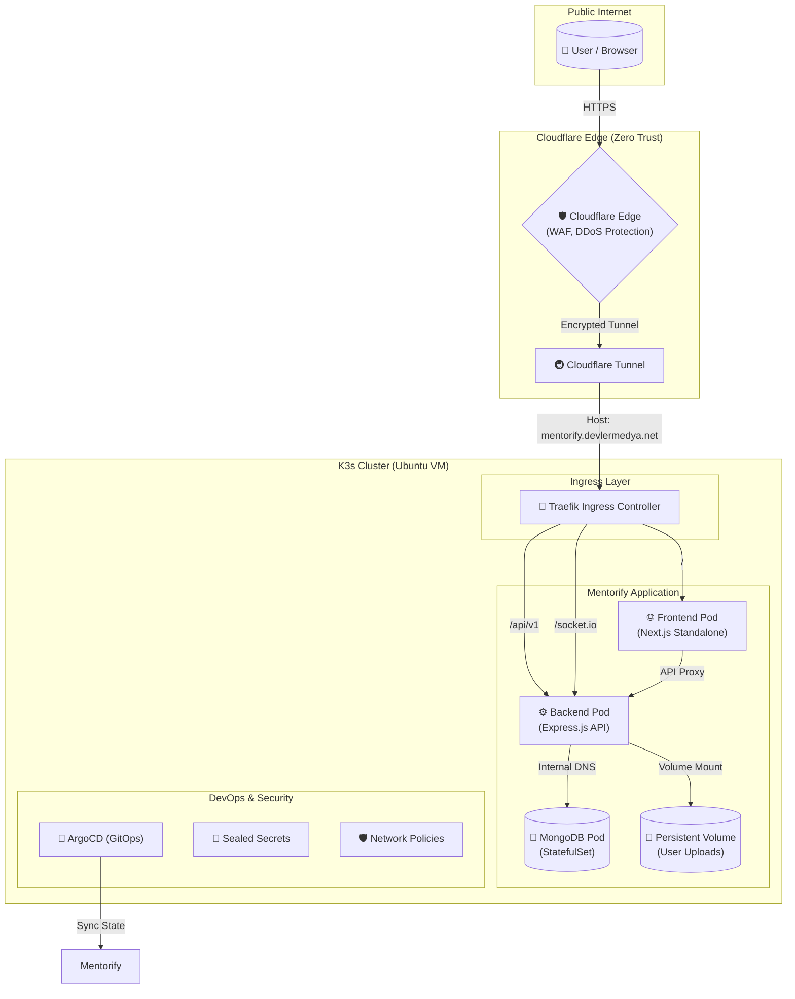

# Mentorify Infrastructure & GitOps 🚀

This repository contains the **Kubernetes Infrastructure**, **GitOps Workflows**, and **Security Configurations** for the Mentorify platform.

## 🏗️ System Architecture

The entire platform is built with a **Zero Trust** mindset, leveraging Cloudflare Tunnels and Kubernetes-native security patterns.

## 🔐 Security Features

### 1. Zero Trust Access
*   **No Exposed Ports:** The VM has **zero** public ports open. All traffic flows through an outbound Cloudflare Tunnel.
*   **Identity-Aware Access:** Admin panels (ArgoCD, Grafana) are protected by Cloudflare Access, requiring GitHub/Google authentication.

### 2. GitOps & Secrets Management
*   **ArgoCD:** Implements a declarative GitOps flow. The cluster state is automatically synced with this repository.
*   **Bitnami Sealed Secrets:** All sensitive data (DB passwords, API keys) are encrypted using asymmetric encryption. Only the cluster's private key can decrypt them. **It is safe to store these encrypted secrets in this public repository.**

### 3. Network Isolation
*   **Pod Segmentation:** Fine-grained **NetworkPolicies** ensure that only the Frontend can talk to the Backend, and only the Backend can talk to MongoDB.
*   **Namespace Isolation:** The application is logically separated from the system and monitoring components.

## 🛠️ Tech Stack
*   **Orchestration:** k3s (Lightweight Kubernetes)
*   **Ingress:** Traefik
*   **GitOps:** ArgoCD
*   **Secrets:** Sealed Secrets
*   **Monitoring:** Prometheus & Grafana
*   **Networking:** Cloudflare Zero Trust (Tunnel & Access)
*   **Service Mesh:** Istio (Optional/Partial)

---
*Built with ❤️ by [Your Name]*
